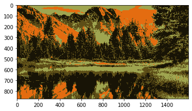

#### [Apparel Recommendation System]()

  

Sample ML code for a user driven system which recommends apparel based on users experiences.

##### Tools & Technologies
- Python, ML libraries - Numpy, Pandas, SciKit Learn, Seaborn, Matplotlib, Scipy, NLTK, PIL

#### [Snapchat Clone ML Application]()

  

Live filter application using Python with Machine Learning libraries.

##### Tools & Technologies
- Python, ML libraries - OpenCV, Numpy

#### [Face Recognition ML Application]()

  

Sample face detection application using KNN algorithm.

##### Tools & Technologies
- Python, ML libraries - OpenCV, Numpy

#### [Handwritten Digit Recognizer]()

  

An ML application which detects the digits present in an image of a handwritten image using Python and some ML libraries.

##### Tools & Technologies
- Python, ML libraries - Numpy, Pandas, Matplotlib

#### [Dominant Color Extraction Application]()

  

  

An OpenCV application which extracts the dominant colours from an image.

##### Tools & Technologies
- Python, ML libraries - OpenCV, Numpy, Matplotlib, SciKit Learn
